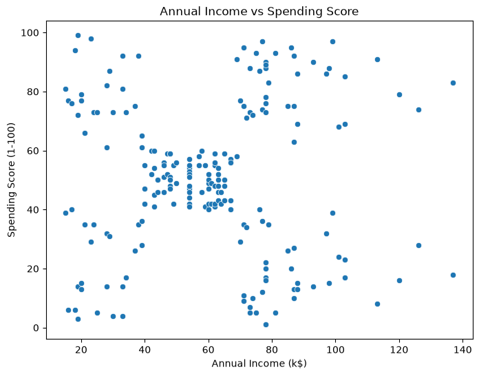
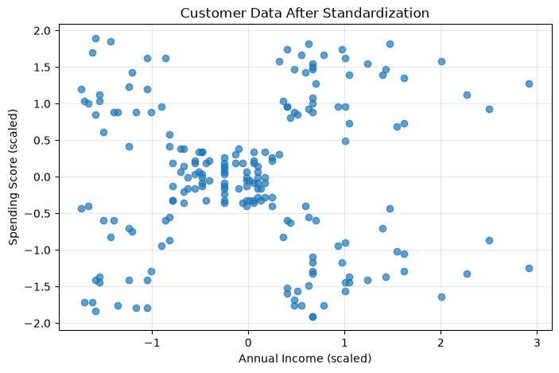
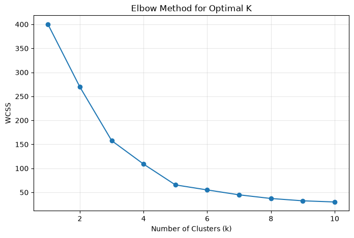
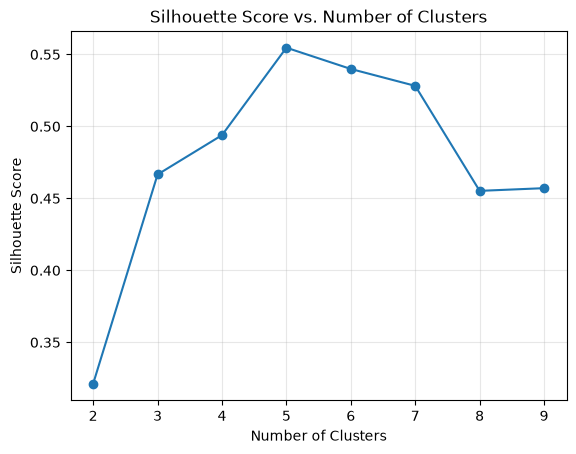
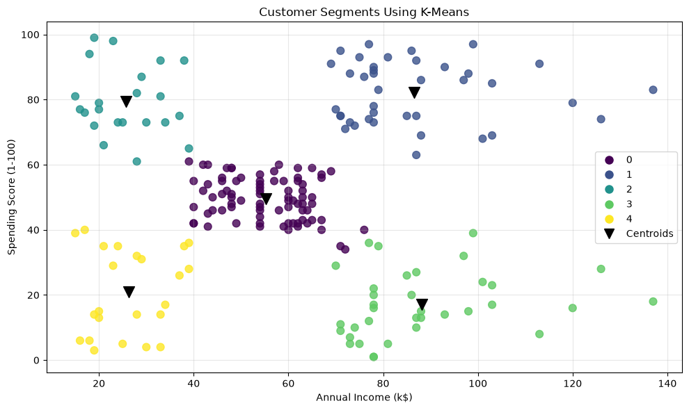
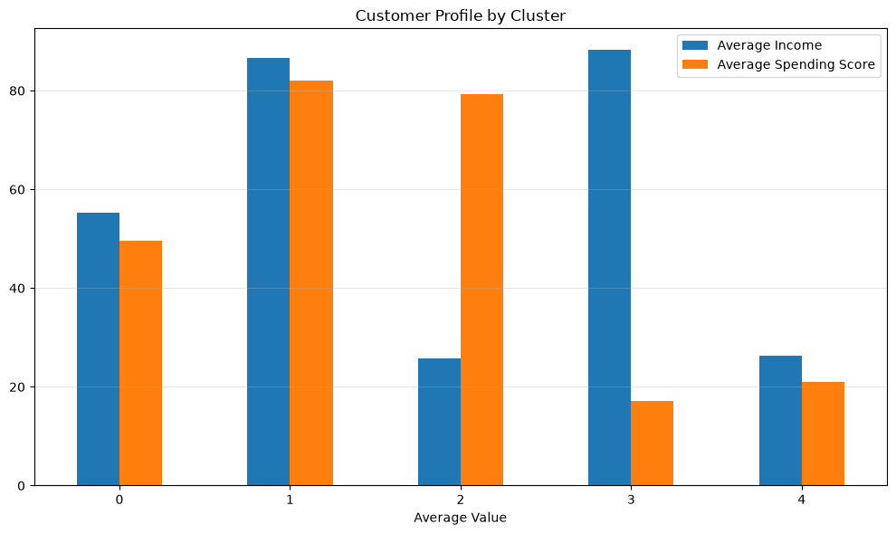

# Customer Segmentation Using K-Means Clustering

Unsupervised machine learning project that segments mall customers into five distinct groups based on annual income and spending behaviour. The project uses K-Means clustering to identify patterns that support more targeted marketing strategies.

## Table of Contents

- [Project Overview](#project-overview)
- [Dataset](#dataset)
- [Repository Structure](#repository-structure)
- [Methodology](#methodology)
- [Exploratory Data Analysis and Visualizations](#exploratory-data-analysis-and-visualizations)
- [Model Evaluation and Selection of K](#model-evaluation-and-selection-of-k)
- [Customer Segment Analysis](#customer-segment-analysis)
- [Technologies Used](#technologies-used)
- [Installation and Setup](#installation-and-setup)
- [Usage and Reusable Functions](#usage-and-reusable-functions)
- [Key Findings](#key-findings)
- [Limitations](#limitations)
- [Future Improvements](#future-improvements)
- [Author and Repository](#author-and-repository)
- [License](#license)

## Project Overview

Customer segmentation divides a customer base into groups that share similar characteristics. Businesses use segmentation to tailor marketing campaigns, allocate resources efficiently, and improve customer retention.

This project applies **unsupervised learning** -- specifically K-Means clustering -- to identify natural groupings in customer data. Unlike supervised approaches, unsupervised learning discovers patterns without predefined labels, making it well-suited for exploratory customer analysis.

**Why K-Means?** K-Means is a widely used centroid-based clustering algorithm that partitions data into K clusters by minimizing within-cluster variance. It is interpretable, computationally efficient on moderate-sized datasets, and produces clearly separable segments when applied to well-scaled numerical features.

The project's main objectives are:

- Identify distinct customer segments using annual income and spending score
- Evaluate cluster quality with the Elbow Method and silhouette analysis
- Visualize and interpret the resulting segments for business decision-making
- Provide reusable Python modules for preprocessing, clustering, and visualization

## Dataset

The dataset is the **Mall Customer Segmentation Data**, a publicly available dataset commonly used for clustering demonstrations.

| Property | Value |
|---|---|
| Records | 200 customers |
| Features | 5 (CustomerID, Gender, Age, Annual Income, Spending Score) |
| Source | Mall Customer Segmentation Data (public domain) |

**Feature descriptions:**

- **CustomerID**: Unique identifier assigned to each customer
- **Gender**: Categorical variable (Male / Female)
- **Age**: Customer age in years
- **Annual Income (k$)**: Annual income in thousands of dollars
- **Spending Score (1-100)**: A score assigned by the mall based on customer behaviour and spending patterns. Higher scores indicate higher spending activity.

**Features selected for clustering:**

- `Annual Income (k$)` -- captures a customer's economic capacity
- `Spending Score (1-100)` -- captures observed spending behaviour

These two features were chosen because they directly relate to a customer's purchasing power and engagement, providing a meaningful basis for segment differentiation.

**Dataset limitations:** The dataset contains 200 records and may not represent a broader customer population. Gender and age were not used as clustering features in this analysis but could provide additional dimensions in future work.

## Repository Structure

```
.
├── data/
│   └── Mall_Customers.csv              # Customer dataset (200 records)
├── notebooks/
│   └── customer_segmentation.ipynb     # Main analysis notebook
├── outputs/
│   └── figures/
│       ├── income_vs_spending.png      # Raw data scatter plot
│       ├── customer_data_after_standardization.png
│       ├── elbow_method.png            # WCSS vs K
│       ├── silhouette_scores.png       # Silhouette score vs K
│       ├── customers_cluster.png       # Final cluster visualization
│       └── cluster_distribution.png    # Cluster statistics bar chart
├── src/
│   └── customer_segmentation/
│       ├── __init.py__                 # Package initializer
│       ├── preprocessing.py            # Feature scaling with StandardScaler
│       ├── clustering.py               # Elbow method, silhouette analysis, K-Means
│       └── visualization.py            # Plotting functions
├── pyproject.toml                      # Project metadata and dependencies
├── uv.lock                             # Pinned dependency versions
├── .python-version                     # Python version specification
└── .gitignore
```

**Directory purposes:**

- **`data/`** -- Contains the raw CSV dataset used for training
- **`notebooks/`** -- Jupyter notebook with the full end-to-end analysis pipeline
- **`src/customer_segmentation/`** -- Reusable Python package with modular functions
  - **`preprocessing.py`** -- `scale_features()` for standardization
  - **`clustering.py`** -- `elbow_method()`, `find_optimal_k()`, `train_kmeans()`
  - **`visualization.py`** -- `plot_elbow()`, `plot_silhouette()`, `plot_clusters()`
- **`outputs/figures/`** -- Exported visualizations generated by the notebook

## Methodology

The project follows a standard clustering workflow:

1. **Load and inspect the dataset** -- Read the CSV file and examine structure, types, and summary statistics
2. **Exploratory data analysis** -- Visualize relationships between features using scatter plots
3. **Feature selection** -- Select `Annual Income (k$)` and `Spending Score (1-100)` as clustering dimensions
4. **Feature scaling** -- Apply `StandardScaler` to standardize both features to zero mean and unit variance
5. **Elbow Method** -- Compute within-cluster sum of squares (WCSS) for K = 1 through 10
6. **Silhouette analysis** -- Evaluate cluster separation and cohesion for K = 2 through 9
7. **Model training** -- Train the final K-Means model with the selected K = 5
8. **Visualization** -- Plot the resulting clusters and cluster centroids
9. **Cluster profiling** -- Compute per-cluster statistics (mean income, mean spending score, customer count)
10. **Interpretation** -- Assign descriptive segment names and discuss business implications

**Why feature scaling matters:** K-Means relies on Euclidean distance to assign points to the nearest centroid. When features have different scales -- annual income in thousands versus a spending score from 1 to 100 -- the feature with the larger magnitude dominates the distance calculation. Standardization ensures that both features contribute equally to the clustering decision.

## Exploratory Data Analysis and Visualizations

### Income vs Spending Score



The scatter plot reveals five visually distinct groups of customers. The data forms rough clusters rather than a single continuous distribution, which suggests that K-Means clustering is an appropriate approach. Some groups show high income with low spending, while others show the inverse, indicating that income alone does not predict spending behaviour.

**Takeaway:** Natural groupings are visible in the raw data, supporting the use of unsupervised clustering.

### Customer Data After Standardization



After applying `StandardScaler`, both features are centered around zero with comparable spreads. The relative positions of data points are preserved, but the axes are now expressed in standard deviations from the mean rather than original units.

**Takeaway:** Standardization removes scale bias without distorting the underlying structure of the data. K-Means can now weight both features equally.

### Elbow Method



The elbow plot shows how within-cluster sum of squares (WCSS) decreases as K increases. WCSS drops sharply from K = 1 to K = 5, after which the rate of improvement slows considerably. The bend at K = 5 suggests a reasonable trade-off between cluster compactness and model complexity.

**Takeaway:** The elbow at K = 5 provides an initial estimate for the number of clusters, pending validation with additional metrics.

### Silhouette Scores



The silhouette analysis evaluates K = 2 through K = 9. Silhouette scores measure how similar points are to their own cluster compared to other clusters, with values ranging from -1 to 1. The score peaks at K = 5, indicating that five clusters achieve the best balance of cohesion and separation among the tested values.

**Takeaway:** K = 5 achieves the highest silhouette score, confirming the Elbow Method's suggestion and providing quantitative support for the final cluster count.

### Final Customer Clusters



The final visualization shows all 200 customers coloured by their assigned cluster. Black downward-pointing triangles mark the centroid of each cluster -- the point representing the average income and spending score for that group. The five clusters occupy distinct regions of the feature space with minimal overlap.

**Takeaway:** K-Means cleanly separates the customer base into five well-defined segments based on income and spending patterns.

### Cluster Distribution



The bar chart compares the average income and average spending score across the five clusters. Cluster 0 contains the largest group of customers with moderate values across both dimensions. Clusters 1 and 3 represent higher-income segments with divergent spending behaviour, while clusters 2 and 4 capture lower-income groups.

**Takeaway:** The five clusters exhibit meaningfully different income-spending profiles, enabling distinct marketing approaches for each segment.

## Model Evaluation and Selection of K

Two complementary metrics were used to select the number of clusters:

**Within-Cluster Sum of Squares (WCSS / Inertia):** Measures the sum of squared distances from each point to its assigned centroid. Lower values indicate tighter clusters. Plotting WCSS against K produces the elbow curve -- the point where additional clusters yield diminishing returns in compactness.

**Silhouette Score:** Measures both cohesion (how close points are within a cluster) and separation (how far clusters are from each other). Values closer to 1 indicate well-separated, compact clusters.

**Selection process:**

- K values from 1 to 10 were evaluated with the Elbow Method
- K values from 2 to 9 were evaluated with silhouette analysis
- K = 5 was selected based on convergence of both metrics: the elbow bend and the peak silhouette score

**Trade-off consideration:** While K = 5 provides the strongest quantitative support, the elbow curve shows some improvement continues through K = 6. Five clusters were chosen because they balance statistical fit with interpretability -- each resulting segment maps to a meaningful and distinct customer profile that a business team could act on.

## Customer Segment Analysis

The K-Means model (K = 5, `random_state = 42`) produced the following segments:

| Cluster | Average Income (k$) | Average Spending Score | Customers | Segment Label |
| ------: | ------------------: | ---------------------: | --------: | :------------ |
| 0 | 55.30 | 49.52 | 81 | Moderate customer activity |
| 1 | 86.54 | 82.13 | 39 | High-value, active spenders |
| 2 | 25.73 | 79.36 | 22 | Active spenders with lower incomes |
| 3 | 88.20 | 17.11 | 35 | Affluent customers with growth potential |
| 4 | 26.30 | 20.91 | 23 | Lower-spending customers |

### Segment Interpretations

**Cluster 0 -- Moderate customer activity (81 customers, 40.5%):** The largest segment, with income and spending near the overall average. These customers represent the core base. Retention and personalized cross-sell offers may be effective strategies for this group.

**Cluster 1 -- High-value, active spenders (39 customers, 19.5%):** High income paired with high spending. This is the most engaged and commercially valuable segment. Loyalty programs, exclusive rewards, and early access to new products could strengthen retention and increase lifetime value.

**Cluster 2 -- Active spenders with lower incomes (22 customers, 11.0%):** Despite lower income, these customers spend at a level comparable to high earners. Budget-friendly product lines, financing options, and value-oriented promotions may resonate with this group.

**Cluster 3 -- Affluent customers with growth potential (35 customers, 17.5%):** High income but low spending. These customers have the financial capacity to spend more but are not currently doing so. Targeted campaigns, personalized recommendations, and premium product introductions could unlock additional spending.

**Cluster 4 -- Lower-spending customers (23 customers, 11.5%):** Lower income and lower spending. Engagement may be driven by affordability, discounts, and essential product categories rather than premium or discretionary offerings.

**Important caveat:** These strategies are inferred from income and spending scores alone. Actual marketing effectiveness depends on factors not captured in this dataset -- purchase history, product categories, channel preferences, and customer lifetime value. The segment labels should be treated as starting points for hypothesis testing, not as proven market segments.

## Technologies Used

| Technology | Purpose |
|---|---|
| Python 3.14 | Core programming language |
| pandas | Data manipulation and analysis |
| NumPy | Numerical computing |
| scikit-learn | K-Means, StandardScaler, silhouette score |
| Matplotlib | Data visualization |
| seaborn | Statistical data visualization |
| Jupyter Notebook | Interactive development and documentation |
| uv | Dependency management and packaging |

Dependencies are specified in `pyproject.toml` and pinned in `uv.lock`.

## Installation and Setup

**Prerequisites:** Python 3.14 or later and `uv` installed on your system.

```bash
# 1. Clone the repository
git clone git@github.com:amine-mlops/Customer-Segmentation.git

# 2. Enter the project directory
cd Customer-Segmentation

# 3. Install dependencies with uv
uv sync

# 4. Launch Jupyter Notebook
uv run jupyter notebook

# 5. Open notebooks/customer_segmentation.ipynb and run all cells
```

The `uv sync` command creates a virtual environment and installs all dependencies at their pinned versions from `uv.lock`. The `uv run` prefix ensures Jupyter runs inside that environment.

## Usage and Reusable Functions

The `src/customer_segmentation/` package provides functions that can be imported and reused in other notebooks or scripts.

### Feature Scaling

```python
from customer_segmentation.preprocessing import scale_features

X_scaled, scaler = scale_features(X)
```

`scale_features` accepts a DataFrame or array of features and returns the standardized array along with the fitted `StandardScaler` object for later inverse transformation.

### Elbow Method

```python
from customer_segmentation.clustering import elbow_method

wcss = elbow_method(X_scaled, k_range=range(1, 11))
```

Returns a list of WCSS values for each K in the specified range.

### Silhouette Analysis

```python
from customer_segmentation.clustering import find_optimal_k

silhouette_scores = find_optimal_k(X_scaled, k_range=range(2, 11))
```

Returns silhouette scores for each candidate K.

### Training K-Means

```python
from customer_segmentation.clustering import train_kmeans

model, labels = train_kmeans(X_scaled, k=5)
```

Returns the fitted `KMeans` model and the cluster labels for each data point.

### Visualization Functions

```python
from customer_segmentation.visualization import (
    plot_elbow,
    plot_silhouette,
    plot_clusters,
)

# Plot the elbow curve
plot_elbow(k_values=range(1, 11), wcss=wcss)

# Plot silhouette scores
plot_silhouette(k_values=range(2, 11), silhouette_scores=silhouette_scores)

# Plot customer clusters with centroids (original-scale coordinates recommended)
plot_clusters(X, labels, centroids=centroids_original_scale)
```

## Key Findings

- **Two features** (annual income and spending score) were sufficient to identify five distinct customer segments
- **K = 5** was selected using both the Elbow Method and silhouette analysis, which converged on the same value
- **The largest segment** (81 customers, 40.5%) represents the moderate core customer base
- **High-value, active spenders** (39 customers) combine high income with high spending and represent the most commercially attractive group
- **Affluent but low-spending customers** (35 customers) present a clear growth opportunity -- they have the income to spend more
- **Income and spending are not linearly related** -- some lower-income customers spend more than higher-income customers, demonstrating that purchasing behaviour is not solely determined by income

## Limitations

- The dataset contains only 200 customers and may not represent the full diversity of a real-world customer base
- Only two features were used for clustering; additional dimensions such as age, gender, purchase frequency, and product categories could produce different segmentations
- K-Means assumes spherical, equally sized clusters and is sensitive to feature selection, scaling, centroid initialization, and the chosen value of K
- Income and spending score alone do not establish profitability, customer lifetime value, or campaign responsiveness
- The model and scaler are not serialized for reuse; each run retrains from scratch

## Future Improvements

The following are planned enhancements, not currently implemented:

- **Alternative clustering algorithms** -- Evaluate DBSCAN, Gaussian Mixture Models, and hierarchical clustering to compare segment stability across methods
- **Additional features** -- Incorporate age and gender to explore multidimensional segmentation
- **Automated tests** -- Add unit tests for the preprocessing, clustering, and visualization modules
- **Model persistence** -- Save the trained K-Means model and scaler using `joblib` or `pickle` for reuse without retraining
- **Interactive dashboard** -- Build a Streamlit application for exploring segments, adjusting parameters, and visualising results in real time
- **Reproducibility** -- Add a `Makefile` or CI workflow to run the analysis pipeline end-to-end and regenerate figures

## Author and Repository

- **Author:** Amine El-baydaouy
- **GitHub:** [github.com/amine-mlops](https://github.com/amine-mlops)
- **Repository:** [github.com/amine-mlops/Customer-Segmentation](https://github.com/amine-mlops/Customer-Segmentation)

## License

No license file is present in this repository.
